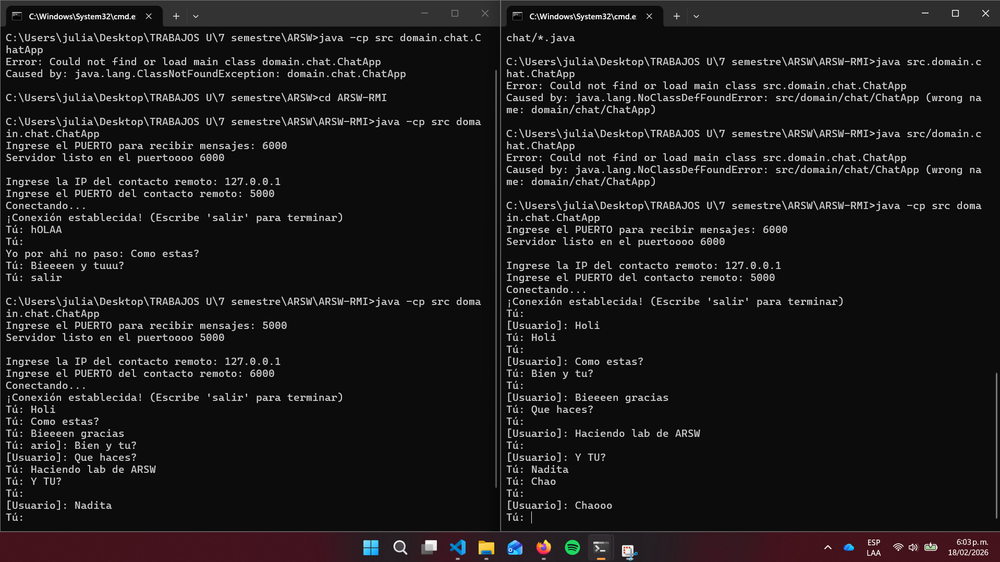

# ARSW-RMI
# Escuela Colombiana de Ingeniería – Arquitecturas de Software  

RMI utiliza un mecanismo basado en stubs y skeletons para implementar la comunicación entre objetos remotos. El mecanismo tiene un funcionamiento básico en el cual el cliente invoca un método en el stub (que es un objeto local), y es este el encargado de hacer la invocación del método en el objeto remoto.

**Figura 7: Modelo de comunicación RMI**

Este mecanismo oculta la complejidad de la comunicación remota. El stub es el encargado de serializar (preparar para transmitirlos) los parámetros que se envían al objeto remoto. Igualmente, el stub se encarga de recibir la respuesta del llamado remoto y deserializarla para que pueda ser manejada por los objetos locales. La función del skeleton es muy similar a la del stub pero del lado del servidor. El skeleton espera por el llamado remoto, recibe los parámetros, realiza el llamado al método necesario y retorna el valor que regresa el método.
## Formas de ejecución

Lo primero es iniciar el servidor de nombres donde se registrarán los objetos que prestan servicios remotos. Este servicio se iniciará en el puerto 23000 y los debe ejecutar desde la raíz del classpath (es decir desde el directorio donde el registry puede encontrar las definiciones de clase):

```bash
rmiregistry 23000
```

Ahora para ejecutar el servidor debe ejecutar desde la consola el siguiente comando:

```bash
java -cp . -Djava.rmi.server.codebase=file:/<pathToClasses>/ -Djava.security.policy=file:/<pathToPolicy>/policy rmiexample.EchoServerImpl
```

Este comando invoca la máquina virtual de Java con tres parámetros específicos:
- **primer parámetro**: define un classpath (cp) donde el programa busca las definiciones de clase
- **codebase**: es donde el sistema de RMI busca las definiciones de clases que necesita enviar por la red
- **security.policy**: define la ubicación del archivo de seguridad antes de invocar la clase a ejecutar

De manera similar, para ejecutar el cliente debe ejecutar desde la consola el siguiente comando:

```bash
java -cp . -Djava.rmi.server.codebase=file:/<pathToClasses>/ -Djava.security.policy=file:/<pathToPolicy>/policy rmiexample.EchoClient
```

## Forma de ejecución chat

1. Abriendo dos terminales en nuestro dispositivo primero compilaremos el proyecto con:

   ```bash
   javac src/domain/chat/*.java
   ```

2. Corremos en ambos terminales el siguiente comando:

   ```bash
   java -cp src domain.chat.ChatApp
   ```

3. Llenamos los datos que nos piden con: 
```bash
    1.  la Terminal 1:
    Puerto local: 5000
    ¡ALTO! Quédate ahí. No pongas la IP ni el puerto remoto todavía.

    2. En la Terminal 2 (Usuario B):

    Puerto local: 6000  (Esto activa el servidor del Usuario B).

    Ahora sí, pon la IP: 127.0.0.1

    Puerto remoto: 5000 (Conectando al Usuario A, que ya tiene su servidor abierto).

    Vuelve a la Terminal 1 (Usuario A):

    3.  que el Usuario B ya activó su puerto 6000, ya puedes poner en la Terminal A:

    IP: 127.0.0.1

    Puerto remoto: 6000
```
### Evidencia chat


---

## Autor

* **Julian Camilo Lopez Barrero** - [JulianLopez11](https://github.com/JulianLopez11)
